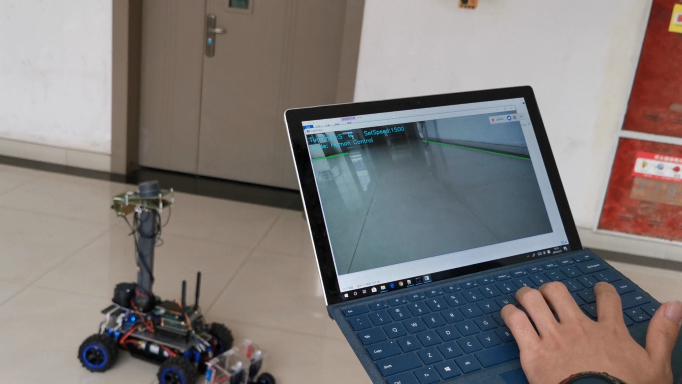

# Visual_system_for_intelligent_delivery_robot
 
## Introduction 

This project is for my thesis "Design of Visual System for Intelligent Delivery Robot" in Intelligent Automobile Innovation Lab, Chongqing University, China, where I worked as an undergraduate research assistant. The whole system consists of three parts: Car, Sercer and Controller. The car was based on Robot Operation System, on Linux. The server was built on Linux. And the Controller was designed on Windows. All codes are written in C++. 

Two main tasks are finished in this project.

- Built a real-time “Car (Linux)-Server (Linux)-Controller (Windows)” vision-based monitor and control system with TCP/IP protocal and h.264 compression standard, limited system delay within 200ms under 4G network.
- Created a vision-based road detection algorithm and implemented with OpenCV, programed the car on Robot Operation System and enabled it to fully auto-run in three types of fields.

## Details

As one of the most important ways for human to perceive the world, vision plays an irreplaceable role in the driving process of human drivers. Machine vision based on video signal also provides indispensable driving decision-making basis and intuitive monitoring data for assistant driving technology and unmanned driving technology. According to the application scenario of intelligent delivery robot, this project focuses on developing a complete and independent visual system for intelligent distribution robot, including road detection technology with good robustness and real-time performance, low-delay multi-data transmission technology, remote monitoring and human rapid takeover technology, real-time object detection and location technology. 

### Road Detection

Firstly, aiming at road detection, in this paper, an improved algorithm is created based on the seed region growth algorithm, which greatly enhances the stability of the segmentation method. The image is processed separately in BGR color space and HSV color space, then the two segmentation results are fused and multi-frame filtered. The experimental results show that the proposed road segmentation scheme has high tolerance to illumination changes, and its robustness and real-time performance meet the requirements of guiding low speed vehicles. 

Road Detection Algorithm Performance

### Vision-based Monitor and Control System

For automatic driving vehicles without manned capacity, this project designs a long-distance, low-delay multi-data transmission system based on general hardware platform, which consists of vehicle, server and background computer. Administrators can take control of the vehicle at any time on the background computer to ensure vehicle operation safety. Using TCP protocol and JPEG/H.264 coding, this paper designs two image transmission modes under LAN and Internet respectively to meet the requirements of different environments. Based on this system, the background end uses Yolo v3 neural network to realize real-time detection of people, vehicles and other objects on the road.

Monitor and Control System Architecture

The user interface for human supervisors is like:

Human Control Mode

Auto Driving Mode

## Display

The following video clip was captured during the test in the campus of Chongqing University.

